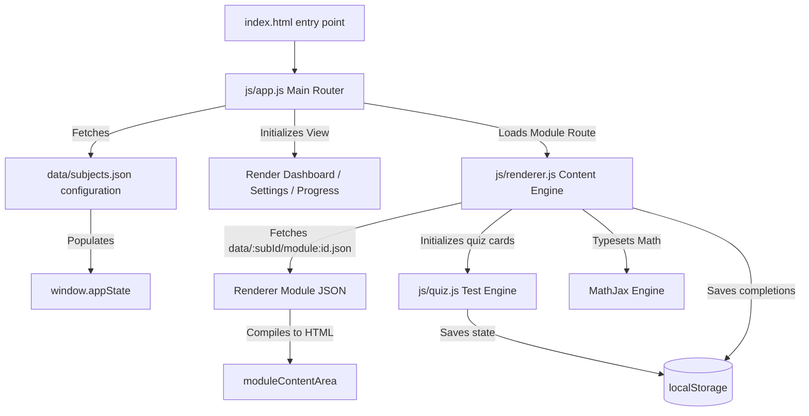

# 📚 BCA Sem 5 Study Hub

An interactive, premium, mobile-first study website for **BCA Semester V** exam preparation. Built as a single-page application (SPA) with pure, dependency-free HTML5, CSS3, and JavaScript (ES6+).

> Brainware University · School of Computational & Applied Sciences · 2026

---

## ✨ Features

- **4 Core Subject Sections** — Software Engineering, Design & Analysis of Algorithms, Full-stack Development II, Machine Learning.
- **20 Structured Modules** — 5 modules per subject, detailing all syllabus topics from start to finish.
- **Dynamic Curriculum Dashboard** — Interactive credit table showing subject codes, credit points, evaluation breakdowns, and lecture structures.
- **Dynamic MCQ Test Engine** — 10 questions per module with interactive card hover states, instant visual feedback, correct/incorrect animations, and explanation card reveals.
- **Interactive Practice Questions** — Short-answer questions with animated, collapsible model answers for exam prep.
- **Placement Interview Tips** — Highlights important placement interview questions and critical insights in specialized callout boxes.
- **Mathematical Formula Engine** — Beautiful dynamic LaTeX formatting using MathJax 3 (supporting algorithm complexities, recurrence trees, COCOMO model formulas, etc.).
- **Local Progress Persistence** — Saves subject module completion states and quiz scorecards dynamically to the browser.
- **"Neon Campus" Glassmorphic Theme** — Modern dark-glass look with a light-mode override, persisting selections using localStorage.
- **Fully Responsive Architecture** — Dynamically adapts layouts for devices from 375px mobile screens up to 4K desktop viewports.

---

## 🛠 Tech Stack & External Scripts

| Tool / Dependency | Purpose | Integration Method |
|-------------------|---------|--------------------|
| **HTML5** | Semantic structure & SEO best practices | Native standard markup |
| **CSS3** | Vanilla variables, glassmorphic styles, keyframe animations | Native CSS stylesheets |
| **JavaScript** | Single-page router, rendering engine, quiz state manager | Pure ES6+ Client-Side modules |
| **Google Fonts** | Premium fonts: *Inter* (body typography) & *JetBrains Mono* (code blocks) | Google Fonts Link Header |
| **MathJax 3** | LaTeX mathematical notation compiler | CDN async loader |
| **Canvas Confetti**| Visual celebration animation on scoring $\ge$ 80% | CDN script loader |

---

## 🏗 System Architecture & Engine Design

The application operates as a client-side Single-Page Application (SPA) without any compilation or build pipelines. The lifecycle is driven by three main JS engines cooperating via a shared state:



### 1. Main Application Shell (`js/app.js`)
- **Routing Engine**: Intercepts `hashchange` events to serve the client-side routes.
- **Global Application State**: Maintains subject details, current theme, and completion progress in `window.appState`.
- **Dashboard Renderer**: Renders dynamic credit breakdown table, calculations, progress bars, and circular progress rings.
- **Theme Manager**: Manages `data-theme` HTML attributes, switching icon overlays and saving configuration preferences.

### 2. Syllabus Rendering Engine (`js/renderer.js`)
- **Lazy Content Loader**: Fetches module-specific JSON data on-demand during route updates.
- **HTML Compiler**: Maps raw JSON topics into structured HTML cards, injecting placement tips and wrapping code blocks.
- **Table of Contents (TOC) Builder**: Traverses headings to compile a floating side navigation panel.
- **Scroll-Spy**: Monitors reading positions using high-performance `IntersectionObserver` to highlight the active section.
- **Touch Swipe Controller**: Binds horizontal swipe swipe-left / swipe-right gestures (`touchstart`, `touchend`) to trigger adjacent module navigation on mobile devices.

### 3. Interactive Quiz & Practice Engine (`js/quiz.js`)
- **MCQ Quiz Engine**: Manages question navigation, hover selection, checking answers, error vibrations, and score cards.
- **Confetti Trigger**: Fires celebration animation using Canvas-Confetti when students score 8/10 or better.
- **Practice Accordions**: Renders model answers that slide open smoothly on user interaction.

---

## 🎨 Design System: "Neon Campus" Colors

The styling utilizes dark glassmorphism. Subjects are assigned custom neon colors to assist visual navigation:

```css
:root {
  /* Neon Accents */
  --accent-se:  #00cec9; /* Neon Teal */
  --accent-daa: #fd79a8; /* Neon Pink */
  --accent-fsd: #fdcb6e; /* Neon Amber */
  --accent-ml:  #55efc4; /* Neon Mint */

  /* Dark Theme Default */
  --bg-primary: #080810;
  --bg-secondary: #0f0f1c;
  --bg-card: rgba(255, 255, 255, 0.04);
  --border-color: rgba(255, 255, 255, 0.08);
  --text-primary: #f1f1f7;
  
  /* Glassmorphism */
  --glass-blur: blur(16px);
  --card-shadow: 0 8px 32px 0 rgba(0, 0, 0, 0.4);
}

:root[data-theme="light"] {
  /* Light Theme Overrides */
  --bg-primary: #f6f8fc;
  --bg-secondary: #ffffff;
  --bg-card: rgba(255, 255, 255, 0.7);
  --border-color: rgba(15, 23, 42, 0.08);
  --text-primary: #0f172a;
}
```

---

## 🔗 Client-Side Routing Scheme

The SPA router matches client-side window hash configurations:

| Route Path | View Target | Description |
|------------|-------------|-------------|
| `#/` | Dashboard / Home | Credits table, overview cards, and key stats |
| `#/subjects` | Subject Catalogue | Overview of the 4 course syllabus domains |
| `#/subject/:subjectId` | Subject Curriculum | Detail view containing outcomes, textbooks, and modules |
| `#/subject/:subjectId/module/:moduleId` | Module Workspace | Lazy-loaded topic sections, mathematical proofs, code, practice lists, and MCQ test |
| `#/progress` | Statistics View | Visual logs showing completion details and quiz high scores |
| `#/settings` | Settings Panel | Controls to toggle themes and factory reset local storage records |

---

## 💾 LocalStorage Persistence Schema

All user progress records are saved on the client using the browser's `localStorage` engine:

```json
// Key: theme
"dark" | "light"

// Key: progress_[subjectId]  (e.g., progress_se)
{
  "1": true,  // Module 1 completed
  "2": false, // Module 2 incomplete
  "5": true   // Module 5 completed
}

// Key: quiz_[subjectId]_[moduleId]  (e.g., quiz_daa_1)
{
  "score": 9,
  "total": 10,
  "percent": 90,
  "date": "2026-06-16"
}
```

---

## 🚀 Quick Start & Local Testing Guide

### ⚠️ Important Notice on Browser CORS Security
Modern browsers restrict AJAX `fetch()` calls on the local file system (`file://` protocols). To run this application locally and allow the JSON module data files to load correctly, **you must serve the project folder using a local web server**.

### How to Run Locally

#### Option A: Using Python (Simplest)
If you have Python installed, run this command in the project directory:
```bash
# Serves the directory on port 8080
python3 -m http.server 8080
```
Then open your browser and navigate to: **[http://localhost:8080](http://localhost:8080)**

#### Option B: Using Node.js (npm)
If you prefer npm packages, you can install and run `http-server` globally or on-demand:
```bash
# Run server on-demand
npx http-server -p 8080
```
Then open: **[http://localhost:8080](http://localhost:8080)**

---

## 📁 Project Directory Structures

```
sem5-web/
├── index.html                 ← Core Entry point, HTML layout shell, SEO, OG meta tags
├── favicon.ico                ← Custom Neon-styled favicon icon file
├── css/
│   └── style.css              ← Design variables, keyframe animations, grid layouts
├── js/
│   ├── app.js                 ← Router, state initialization, settings, progress logs
│   ├── renderer.js            ← Content rendering compiler, Touch Swipe gestures
│   └── quiz.js                ← Interactive MCQ evaluation card, Practice questions
├── data/
│   ├── subjects.json          ← Subject definitions, objectives, credit requirements
│   ├── se/                    ← Software Engineering Modules (1 - 5)
│   ├── daa/                   ← Design & Analysis of Algorithms Modules (1 - 5)
│   ├── fsd/                   ← Full-stack Development II Modules (1 - 5)
│   └── ml/                    ← Machine Learning Modules (1 - 5)
├── implementation.md          ← Original design implementation documentation
├── todos.md                   ← Day-wise milestone tasks tracking logs
└── README.md                  ← This document
```

---

## 📄 License

This project is built for educational and exam preparation purposes.
Syllabus curriculum structures are aligned with the official guidelines of Brainware University.